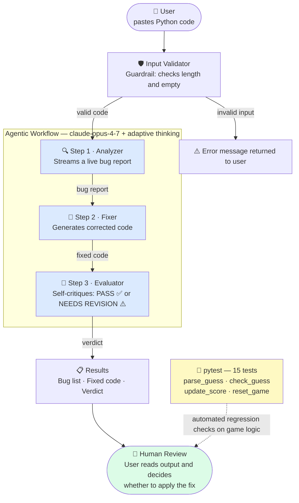

# Applied AI System: Game Glitch Investigator + AI Bug Detective

This project extends the original **Game Glitch Investigator** (a Streamlit number-guessing game with intentional bugs) into a full applied AI system with an **AI Bug Detective** — a three-step agentic pipeline that analyzes Python code, generates a fix, and verifies its own work.

---

## What it does

The app has two tabs:

| Tab | Description |
|-----|-------------|
| 🎮 Glitchy Guesser | The original number-guessing game from Module 1 (fixed and playable) |
| 🕵️ AI Bug Detective | Paste any Python code — the AI agent finds the bugs, fixes them, and critiques the fix |

---

## AI Feature: Agentic Workflow

The Bug Detective uses **Claude claude-opus-4-7** in a three-step agent pipeline:



Each step uses **adaptive thinking** (`thinking: {type: "adaptive"}`), letting the model decide how deeply to reason before responding. All three API calls are logged to the terminal with token counts.

---

## Setup

### 1. Install dependencies

```bash
pip install -r requirements.txt
```

### 2. Get an Anthropic API key

Sign up at [console.anthropic.com](https://console.anthropic.com/) and create an API key.

### 3. Add your API key

Copy the example env file and fill in your key:

```bash
cp .env.example .env
# edit .env and replace "your_api_key_here" with your real key
```

### 4. Run the app

```bash
python -m streamlit run app.py
```

---

## Run the tests

```bash
pytest tests/
```

All tests cover the core game logic (`parse_guess`, `check_guess`, `update_score`, `reset_game`).

---

## Project structure

```
.
├── app.py              # Streamlit app (two tabs: game + detective)
├── ai_detective.py     # Agentic workflow — the three Claude API calls
├── logic_utils.py      # Shared game logic functions
├── tests/
│   └── test_game_logic.py
├── requirements.txt
├── .env.example
└── reflection.md
```

---

## Logging and guardrails

- Every API call logs the step name, model, and token counts to stdout.
- Input is validated before any API call (empty check, 5,000-character limit).
- All three API steps have individual `try/except` blocks — a failure in one step surfaces a clear error without crashing the rest of the UI.
- The API key is read from the environment; the app shows a setup message if it is missing rather than erroring silently.
- The `anthropic` SDK retries rate-limit and server errors automatically (default: 2 retries with exponential backoff).
