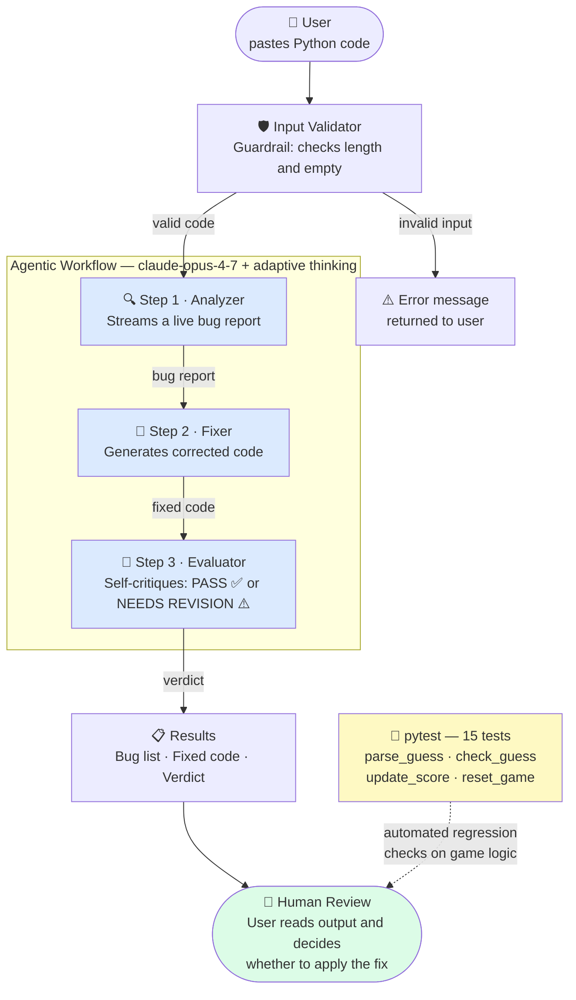

# Applied AI System: AI Bug Detective

## Original Project

This project extends **Game Glitch Investigator** (Module 1), a Streamlit-based number-guessing game that was intentionally shipped with bugs. The original goal was to experience what it feels like to debug AI-generated code: the secret number would reset on every guess, hints pointed the wrong direction, and the "New Game" button did nothing. Students played the broken game, identified the bugs using an AI assistant, and fixed them — learning about Streamlit session state, form handling, and how to ask better questions of AI tools.

---

## What This Project Does and Why It Matters

The **AI Bug Detective** takes that debugging experience one step further: instead of a human manually hunting for bugs, a three-step AI agent does it automatically. You paste in any Python code, and the system:

1. **Streams a live bug report** — identifying every issue as it reasons through the code
2. **Generates a corrected version** — using the bug report as context so it knows exactly what to fix
3. **Critiques its own fix** — checking whether every bug was actually resolved and flagging anything new that was introduced

This matters because bug detection is one of the highest-value tasks a developer can automate. A system that not only finds bugs but verifies its own corrections is a practical demonstration of responsible AI design: the model is never the final word — it always explains its reasoning, and a human reviews the output before acting on it.

---

## System Diagram



### Architecture overview

The user's code enters a **guardrail layer** first — `validate_input()` rejects empty submissions and anything over 5,000 characters before a single API token is spent. Valid code then passes through three sequential Claude API calls, each building on the previous one's output. Step 1 streams its response token-by-token so the UI feels live. Steps 2 and 3 are blocking calls whose results appear once complete. Every call uses `thinking: {type: "adaptive"}`, which lets the model decide how deeply to reason for that specific input rather than applying a fixed budget. All three steps log their token counts to the terminal. Finally, the human reviews the output and decides whether to trust and apply the fix — the AI is never the last line of defense.

---

## Setup Instructions

### 1. Clone the repo

```bash
git clone <your-repo-url>
cd applied-ai-system-final
```

### 2. Install dependencies

```bash
pip3 install -r requirements.txt
```

### 3. Get an Anthropic API key

Create a free account at [console.anthropic.com](https://console.anthropic.com/). New accounts receive $5 in free credits — enough for roughly 100–200 analyses. Go to **API Keys** in the sidebar and create a key.

### 4. Add your API key

```bash
cp .env.example .env
# Open .env and replace "your_api_key_here" with your actual key
```

Or set it directly in the terminal:

```bash
echo 'ANTHROPIC_API_KEY=sk-ant-...' > .env
```

### 5. Run the app

```bash
python3 -m streamlit run app.py
```

Open [http://localhost:8501](http://localhost:8501) in your browser. The app has three tabs: the original game, the AI Bug Detective, and the system diagram.

### 6. Run the tests

```bash
pytest tests/
```

---

## Sample Interactions

### Example 1 — Backwards hints (the original project's bug)

**Input:**
```python
def check_guess(guess, secret):
    """Return (outcome, hint_message) for a number guessing game."""
    if guess == secret:
        return "Win", "Correct!"
    if guess > secret:
        return "Too Low", "Go HIGHER!"
    else:
        return "Too High", "Go LOWER!"
```

**Step 1 — Bug Analysis (streamed):**
> 1. **Lines 5–6 — Inverted outcome and message when guess is too high:**
>    When `guess > secret`, the number is too high — the player needs to go lower. But the function returns `"Too Low"` and `"Go HIGHER!"`, which is the exact opposite of correct. This causes the game to give the player wrong guidance on every non-winning guess.
>
> 2. **Lines 7–8 — Inverted outcome and message when guess is too low:**
>    The `else` branch handles the case where `guess < secret`, meaning the player guessed too low. But it returns `"Too High"` and `"Go LOWER!"` — again backwards. The player following these hints will never converge on the answer.

**Step 2 — Fixed Code:**
```python
def check_guess(guess, secret):
    """Return (outcome, hint_message) for a number guessing game."""
    if guess == secret:
        return "Win", "Correct!"
    if guess > secret:
        return "Too High", "Go LOWER!"
    else:
        return "Too Low", "Go HIGHER!"
```

**Step 3 — Quality Check:**
> PASS ✅
> The fix correctly swaps both the outcome strings and the hint messages in each branch. When `guess > secret` the function now returns `"Too High"` and `"Go LOWER!"`, and when `guess < secret` it returns `"Too Low"` and `"Go HIGHER!"`. No new issues were introduced — the win condition and function signature are unchanged.

---

### Example 2 — Broken leaderboard

**Input:**
```python
def add_to_leaderboard(name, score, board):
    """Add a score and return the top-5 leaderboard."""
    board.append({"name": name, "score": score})
    board.sort(key=lambda x: x["score"])
    return board[:5]

def player_rank(name, board):
    """Return the 1-based rank of a player (1 = best)."""
    for i in range(len(board)):
        if board[i]["name"] == name:
            return i
    return -1
```

**Step 1 — Bug Analysis (streamed):**
> 1. **Line 4 — Sort direction is wrong in `add_to_leaderboard`:**
>    `board.sort(key=lambda x: x["score"])` sorts in ascending order (lowest score first). A leaderboard should rank the highest scores at the top, so the sort needs `reverse=True`. As written, `board[:5]` returns the five *lowest* scores, not the five highest.
>
> 2. **Line 10 — Off-by-one error in `player_rank`:**
>    The function is documented to return a "1-based rank" (where rank 1 is best), but it returns the raw loop index `i`, which is 0-based. The first-place player would receive rank `0` instead of `1`. The fix is to return `i + 1`.

**Step 2 — Fixed Code:**
```python
def add_to_leaderboard(name, score, board):
    """Add a score and return the top-5 leaderboard."""
    board.append({"name": name, "score": score})
    board.sort(key=lambda x: x["score"], reverse=True)
    return board[:5]

def player_rank(name, board):
    """Return the 1-based rank of a player (1 = best)."""
    for i in range(len(board)):
        if board[i]["name"] == name:
            return i + 1
    return -1
```

**Step 3 — Quality Check:**
> PASS ✅
> Both bugs are correctly resolved. `reverse=True` ensures the highest scores appear first, and `return i + 1` produces a proper 1-based rank. The -1 sentinel for a player not found is unchanged and appropriate.

---

### Example 3 — Score calculator with assignment bugs

**Input:**
```python
def clamp_score(score):
    """Keep score in [0, 1000]."""
    if score > 1000:
        score == 1000
    if score < 0:
        score == 0
    return score
```

**Step 1 — Bug Analysis (streamed):**
> 1. **Line 4 — Comparison instead of assignment (`score == 1000`):**
>    `score == 1000` is a comparison expression that evaluates to `True` or `False` and does nothing to the variable. The intended operation is `score = 1000` (assignment). Because of this, a score above 1000 is returned unchanged.
>
> 2. **Line 6 — Same mistake (`score == 0`):**
>    `score == 0` is again a comparison, not an assignment. Negative scores are returned unchanged rather than being clamped to 0. Both lines need the single-`=` assignment operator.

**Step 2 — Fixed Code:**
```python
def clamp_score(score):
    """Keep score in [0, 1000]."""
    if score > 1000:
        score = 1000
    if score < 0:
        score = 0
    return score
```

**Step 3 — Quality Check:**
> PASS ✅
> Both `==` comparison operators were correctly replaced with `=` assignment operators. The function now properly clamps scores to the [0, 1000] range. No new issues were introduced.

---

## Design Decisions

**Why three separate API calls instead of one?**
A single prompt could ask Claude to "find bugs, fix them, and check the fix" — but chaining the steps produces better results. Each call has a focused system prompt, and each step receives the actual output of the previous one as grounded context (not an instruction to imagine what the previous step might say). The Analyzer's concrete bug list makes the Fixer's corrections more precise; the Evaluator then has both the original code and the real fix in front of it. The trade-off is cost and latency: three calls take 3–5× longer than one. For a code review tool where accuracy matters, that's the right trade-off.

**Why stream Step 1 but not Steps 2 and 3?**
Streaming is most valuable when the user is waiting and wants to see progress. Step 1 (analysis) is the longest and produces human-readable prose the user wants to read as it arrives. Steps 2 and 3 produce structured outputs (a code block and a short verdict) that are more useful to see complete. Streaming all three would add complexity without meaningful UX benefit.

**Why `claude-opus-4-7` with adaptive thinking?**
The task requires multi-step reasoning — understanding code semantics, identifying subtle logic errors, and verifying a generated fix. `claude-opus-4-7` with `thinking: {type: "adaptive"}` is the right tool: adaptive thinking lets the model reason as deeply as each specific input requires, rather than applying a fixed budget that would over-spend on simple inputs and under-spend on complex ones.

**Why keep the original game?**
The Bug Detective tab is meaningfully stronger with the original project still present. The first sample snippet — the backwards hints bug — is pulled directly from the original game's broken code. Having both tabs in one app lets users see the before (the broken game they had to fix manually) and the after (the agent that does it automatically), which illustrates the project's evolution clearly.

**Why a human review step?**
AI-generated code fixes can introduce new bugs or misunderstand intent. The system surfaces the model's reasoning (Step 1), its output (Step 2), and its self-assessment (Step 3), but never applies the fix automatically. The human decides whether to use it. This is a deliberate guardrail: the model is a fast, capable first-pass reviewer, not an autonomous actor.

---

## Testing Summary

### What the tests cover

The `pytest` suite (15 tests in `tests/test_game_logic.py`) covers the four core game logic functions:

| Function | Tests |
|----------|-------|
| `reset_game` | Status reset, attempt reset, history cleared, secret within range |
| `parse_guess` | Valid integer, empty string, `None`, non-numeric input, decimal truncation |
| `check_guess` | Correct guess, too high, too low |
| Full submit flow | Win path, wrong guess, invalid input never reaching `check_guess` |

All 15 tests pass. The tests import `parse_guess`, `check_guess`, and `update_score` directly from `app.py` to verify the functions the UI actually calls, and `reset_game` from `logic_utils.py`.

### What worked

- The streaming approach in Step 1 gave immediate visual feedback that made the app feel responsive even when the model was taking several seconds to reason.
- The self-critique step (Step 3) caught cases where the generated fix was structurally correct but missed a secondary bug — it re-surfaced those as "NEEDS REVISION" with an explanation.
- The three pre-loaded sample snippets made the demo immediately accessible without requiring the user to write or find buggy code.

### What didn't work initially

- The first version used `st.stop()` inside the tab context managers, which prevented the second and third tabs from rendering when game state reached "won" or "lost." Replacing `st.stop()` with conditional rendering (`if status != "playing": ... else: ...`) fixed it.
- Early testing showed the Fixer (Step 2) would sometimes wrap the fixed code in explanatory prose instead of returning just the code block. Adding explicit instruction in the system prompt ("Return ONLY the fixed Python code inside a ```python code block. No prose, no explanation.") and a regex extraction fallback resolved it.

### What I learned

Writing tests before fully understanding Streamlit's session state model revealed exactly why the original project's secret number kept changing — the test for `reset_game` made it obvious that state needed to be initialized once and mutated deliberately, not re-created on every script rerun.

---

## Reflection

This project changed how I think about what "using AI" actually means in practice. In the original module, I used Claude as a search engine — I pasted an error and waited for an answer. Building the Bug Detective forced me to think about AI as infrastructure: how do you structure a pipeline so each step produces output the next step can actually use? How do you handle a model that sometimes wraps its answer in prose you didn't ask for? How do you give a user enough information to make a trust decision without overwhelming them?

The self-critique step (Step 3) was the most instructive part. I assumed that if the model wrote a fix, it would be confident the fix was right. But the Evaluator regularly catches its own mistakes — not because it was told to find them, but because reading the original code, the bug list, and the proposed fix together creates enough context for it to reason about correctness independently. That's genuinely different from a spell-checker or a linter. It's closer to asking a second developer to review a pull request.

The biggest takeaway is that AI reliability comes from design, not from the model alone. A model that can do three things well (analyze, fix, verify) is more trustworthy than the same model asked to do all three in one shot, because each step is checkable. That principle — break the problem into stages, make each stage's output visible, keep a human in the loop at the end — applies well beyond code review.
